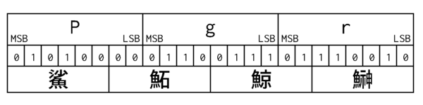

# uoencode
Uoencode encodes each 3byte of input into 4 uo('魚', うお) characters.

## Basic concept

The table below shows how the word "Pgr" is encoded.

First, a bunch of three octets 0x50(P) 0x67(g) 0x72(r) is sliced into four pieces of 6-bit section. Next, Uo-characters corresponding each 6-bit patterns are looked up in the table. And then, 4 Uo-characters are converted into a byte sequence of the specific encoding.

The following table shows the conversion of the decimal value of the 6-bit fields and their corresponding Uo character.

|6bits|Uo|UTF-16|EUC-JP| |6bits|Uo|UTF-16|EUC-JP|
|---:|:---:|---|---|---|---:|:---:|---|---|
| 0|魴|9b 74|f2 b7| |32|鯲|9b f2|f2 ce|
| 1|鮃|9b 83|f2 b9| |33|鯵|9b f5|b0 b3|
| 2|鮎|9b 8e|b0 be| |34|鰆|9c 06|f2 d6|
| 3|鮑|9b 91|f2 ba| |35|鰈|9c 08|f2 d7|
| 4|鮒|9b 92|ca ab| |36|鰉|9c 09|f2 d3|
| 5|鮓|9b 93|f2 b8| |37|鰊|9c 0a|f2 d9|
| 6|鮖|9b 96|f2 bb| |38|鰌|9c 0c|f2 d5|
| 7|鮗|9b 97|f2 bc| |39|鰍|9c 0d|b3 e2|
| 8|鮟|9b 9f|f2 bd| |40|鰐|9c 10|cf cc|
| 9|鮠|9b a0|f2 be| |41|鰒|9c 12|f2 d8|
|10|鮨|9b a8|f2 bf| |42|鰓|9c 13|f2 d4|
|11|鮪|9b aa|cb ee| |43|鰕|9c 15|f2 d1|
|12|鮫|9b ab|bb ad| |44|鰛|9c 1b|f2 dc|
|13|鮭|9b ad|ba fa| |45|鰤|9c 24|f2 de|
|14|鮮|9b ae|c1 af| |46|鰥|9c 25|f2 dd|
|15|鮴|9b b4|f2 c0| |47|鰭|9c 2d|c9 c9|
|16|鮹|9b b9|f2 c3| |48|鰮|9c 2e|f2 db|
|17|鯀|9b c0|f2 c1| |49|鰯|9c 2f|b0 f3|
|18|鯆|9b c6|f2 c4| |50|鰰|9c 30|f2 e0|
|19|鯉|9b c9|b8 f1| |51|鰹|9c 39|b3 ef|
|20|鯊|9b ca|f2 c2| |52|鰻|9c 3b|b1 b7|
|21|鯏|9b cf|f2 c5| |53|鰾|9c 3e|f2 e4|
|22|鯑|9b d1|f2 c6| |54|鱆|9c 46|f2 e3|
|23|鯒|9b d2|f2 c7| |55|鱇|9c 47|f2 e1|
|24|鯔|9b d4|f2 cb| |56|鱈|9c 48|c3 ad|
|25|鯖|9b d6|bb aa| |57|鱒|9c 52|cb f0|
|26|鯛|9b db|c2 e4| |58|鱗|9c 57|ce da|
|27|鯡|9b e1|f2 cc| |59|鱚|9c 5a|f2 e5|
|28|鯣|9b e3|f2 c8| |60|鱠|9c 60|f2 e6|
|29|鯨|9b e8|b7 df| |61|鱧|9c 67|f2 e7|
|30|鯰|9b f0|f2 d0| |62|鱶|9c 76|f2 e8|
|31|鯱|9b f1|f2 cf| |63|鱸|9c 78|f2 e9|
